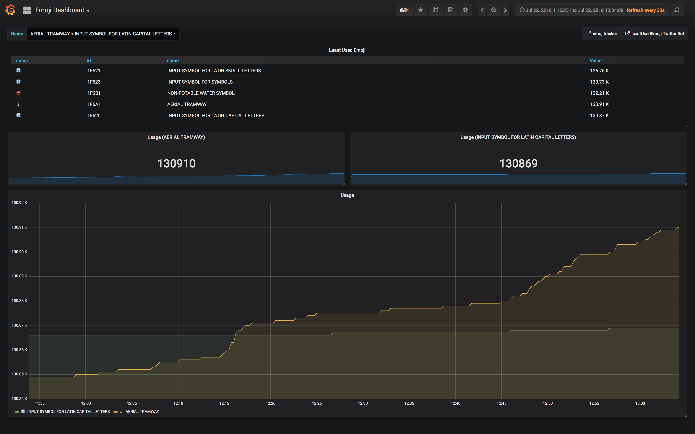

# Prometheus Exporter for Twitter Emojis


Proof of Concept, using Emojitracker APIs:

- [https://github.com/emojitracker/emojitrack-rest-api](Emojitracker REST API)
- [https://github.com/emojitracker/emojitrack-streamer-spec](Emojitracker Streaming API)


## Usage

Copy `example.env` to `.env`, and modify as necessary:

| Variable           | What it does                                                                    |
|--------------------|---------------------------------------------------------------------------------|
| `LOG_LEVEL`        | Log verbosity of the exporter. Options are: debug, info, warn, error            |

### Local

Run locally with:

```
go run *.go
```

### Docker

Launch the exporter, as well as a prometheus instance with:

```
docker-compose up -d
```

Prometheus will be available, on [http://localhost:9090](http://localhost:9090)

The docker-compose file also comes with Grafana, with a pre-configured dashboard, on [http://localhost:3000](http://localhost:3000) (username/password: admin/foobar)


